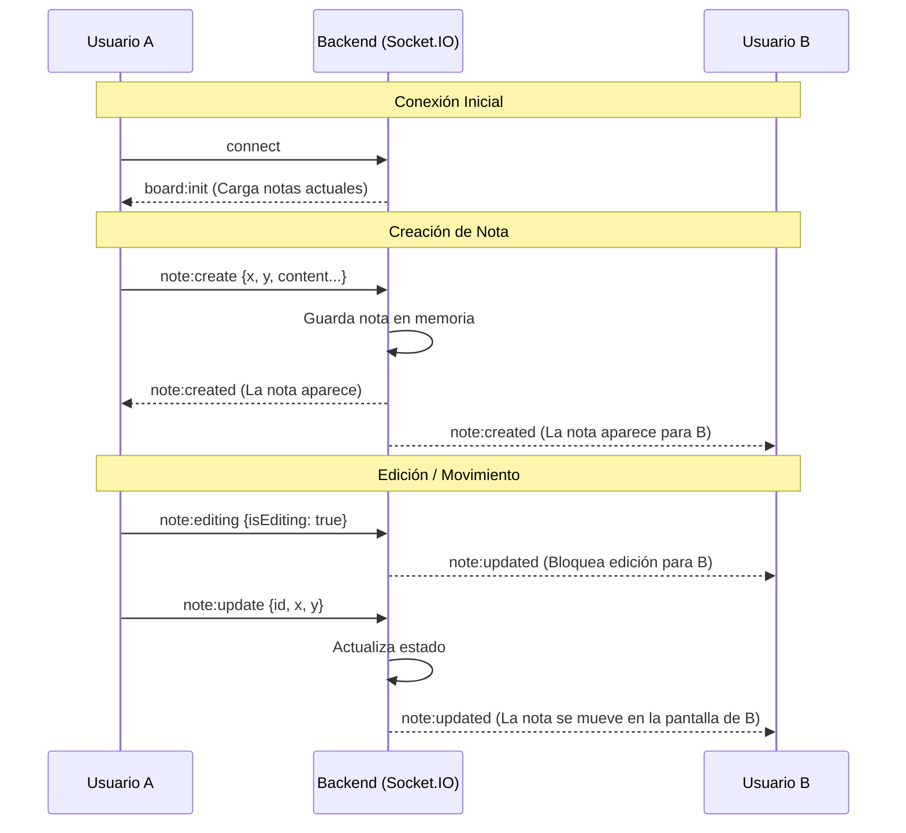

# Reto Técnico Vue - Real-time Collaborative Board

Este proyecto es un tablero colaborativo en tiempo real donde los usuarios pueden crear, editar, mover, redimensionar y eliminar notas. Los cambios se reflejan instantáneamente para todos los usuarios conectados.

---

## 🚀 Setup y Ejecución

### Prerrequisitos
- Node.js (v18+ recomendado)
- npm

### Instalar dependencias

```bash
cd backend
npm install
cd ../frontend
npm install
```

### Iniciar ambiente de desarrollo

```bash
./start_dev.sh
```

### Correr tests

```bash
./run_tests.sh
```

### Uso en ambiente de desarrollo

1. Abre la URL del frontend (http://localhost:5173) en dos pestañas o navegadores diferentes.
2. Ingresa un nombre de usuario en cada una.
3. Crea y mueve notas en una pestaña y observa cómo se actualiza en la otra en tiempo real.

---

## 🏗 Arquitectura del Proyecto

A continuación se detallan los archivos principales de la aplicación:

### Backend (`/backend`)
- Se usó el proyecto base proveído con modificaciones para soportar nuevas funcionalidades.

### Frontend (`/frontend`)
Componentes principales:

#### Lógica y Estado
- **`src/stores/notes.ts`**: Centraliza el estado de las notas y contiene la lógica para emitir eventos de socket al backend.
- **`src/stores/socket.ts`**: Gestiona la conexión al cliente Socket.IO.
- **`src/stores/users.ts`**: Maneja la lista de usuarios conectados.

#### Vistas y Componentes
- **`src/components/LoginDialog.vue`**: Formulario inicial para que el usuario ingrese su nombre.
- **`src/views/BoardView.vue`**: Vista principal. Contiene el lienzo (canvas) y renderiza las notas.
- **`src/components/UserList.vue`**: Lista de usuarios conectados en tiempo real.
- **`src/components/NoteItem.vue`**: Componente complejo que renderiza una nota individual y gestiona sus interacciones. 
- **`src/components/NoteComments.vue`**: Sub-componente para visualizar y añadir comentarios a una nota.

---

## 🔄 Diagrama de Eventos en Tiempo Real

El siguiente diagrama muestra el flujo de eventos cuando un usuario crea y mueve una nota:



## 🧠 Decisiones Técnicas y Trade-offs

- **Concurrencia**: Se implementa un bloqueo optimista para evitar conflictos de escritura. Para eso se definió un nuevo evento de sockets llamado `note:editing` que se encarga de bloquear la edición de una nota para los demás usuarios. En caso de que el bloqueo no se ejecute correctamente, el sistema guarda la última modificación hecha.
- **Enfasis en diseño e interactividad**: Se priorizó la experiencia del usuario. Se usó Tailwind CSS para diseño rápido y código mantenible usando la etiqueta @apply. Se implementó un lienzo grande que se puede arrastrar para permitir que el usuario pueda crear y mover fácilmente. Además se implementó la capacidad de modificar el tamaño de las notas y el manejo de z-index para que se superpongan correctamente.
- **Uso de composables**: Se implementaron composables para la lógica de drag and drop y redimensionamiento de las notas.

---

## 🛠 Limitaciones conocidas

- No se implementó persistencia en base de datos por limitaciones de tiempo.
- No hay manejo para colisión de usuarios con el mismo nombre, se debería implementar manejo de ID única por usuario (además de la ID de canal de socket)
- Condiciones de borde extremas no testeadas.
- Comportamiento del cuadro de comentarios cuando se seleccionan otras notas podría ser mejorado.
- Si se arrastra una nota hacia la esquina del canvas, puede que quede inaccesible (fuera del scroll máximo de la ventana del browser).


